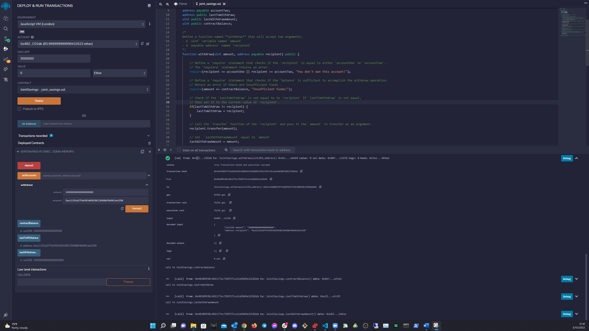

<!-- Find and Replace All [repo_name] -->
<!-- Replace [product-screenshot] [product-url] -->
<!-- Other Badgets https://naereen.github.io/badges/ -->
[![Contributors][contributors-shield]][contributors-url]
[![Forks][forks-shield]][forks-url]
[![Stargazers][stars-shield]][stars-url]
[![Issues][issues-shield]][issues-url]
[![LinkedIn][linkedin-shield]][linkedin-url]
<!-- [![License][license-shield]][license-url] -->


<!-- TABLE OF CONTENTS -->
<details open="open">
  <summary>Table of Contents</summary>
  <ol>
    <li>
      <a href="#about-the-project">About The Project</a>
      <ul>
        <li><a href="#built-with">Built With</a></li>
      </ul>
    </li>
    <li>
      <a href="#getting-started">Getting Started</a>
      <ul>
        <li><a href="#prerequisites">Prerequisites</a></li>
        <li><a href="#installation">Installation</a></li>
      </ul>
    </li>
    <li><a href="#usage">Usage</a></li>
    <li><a href="#roadmap">Roadmap</a></li>
    <li><a href="#contributing">Contributing</a></li>
	<!-- <li><a href="#license">License</a></li> -->
    <li><a href="#contact">Contact</a></li>
    <li><a href="#acknowledgements">Acknowledgements</a></li>
  </ol>
</details>

---

<!-- ABOUT THE PROJECT -->
## About The Project

This is an application based on a Solidity smart contract that uses ether management functions to implement a financial institution’s features of a joint savings account. The smart contract accepts two addresses and only these addresses control the joint savings account. The account holders have the ability to deposit and withdraw funds from the account and the smart contract.

---

### Built With

<!-- This section should list any major frameworks that you built your project using. Leave any add-ons/plugins for the acknowledgements section. Here are a few examples. -->

* [Solidity v0.5.0](https://docs.soliditylang.org/en/v0.5.0/)
* [Remix - Ethereum IDE](https://remix-ide.readthedocs.io/en/latest/index.html)

---

<!-- GETTING STARTED -->
## Getting Started

<!-- This is an example of how you may give instructions on setting up your project locally. To get a local copy up and running follow these simple example steps. -->

I have placed Comments throughout the code so that you can follow the Lambda code and be able to replicate the app on your own. Also, so that you're able to contribute in the future :-)

---

### Prerequisites

<!-- This is an example of how to list things you need to use the software and how to install them. -->
A text editor such as [VS Code](https://code.visualstudio.com/) or [Sublime Text](https://www.sublimetext.com/) is not needed for this application.

You can build your smart contract directly on the [Remix IDE](https://remix.ethereum.org/).

Make sure that you become familiar with the documentation for [Remix IDE](https://remix-ide.readthedocs.io/en/latest/index.html) and [Solidity v5](https://docs.soliditylang.org/en/v0.5.0/) before you get started

### Installation

1. Clone the repo
   ```sh
   git clone https://github.com/AnaIitico/Blockchain_Savings_Account.git
   ```

---

<!-- USAGE EXAMPLES -->
## Usage
  
<!-- Use this space to show useful examples of how a project can be used. Additional screenshots, code examples and demos work well in this space. You may also link to more resources. -->

#### This image displays the contract deployment and the 1st deposit
  - Deployed Contract hash 0x0648bdaae482a01c010af46ee8529d9c74aa435e6b9fc30b293c7c5aeccd064d
  - Deposited 1 Ether in wei (1000000000000000000 wei) hash 0xee0a10162c705edbc43908f9930832e3399f573d3c732a103d377deb4a319fc9
  - Shows new contractBalance 1000000000000000000 on the Remix IDE panel


---

#### This image displays the 2nd deposit
  - Deposited 10 Ether in wei (5000000000000000000 wei) hash 0xbe04d0f36d5563aa8e59612dec0e6602d2cc281d533c9a3b56c0fa7dcb98cfaa
  - Shows new contractBalance 11000000000000000000 on the Remix IDE panel


---

#### This image displays the 3rd deposit
  - Deposited 5 Ether in wei (10000000000000000000 wei) hash 0xd8d51a8c2b2a060adae357856d81e1eb0946c5dfb6c32d92e3cd4a60229e0727
  - Shows new contractBalance 16000000000000000000 on the Remix IDE pannel


---

#### This image displays setting the deposit accounts
  - account1 0x1bF05387f52e67baa3862DBa11d0F12D9d56518C
  - account2 0xa11191eD7FeE493465038CC8498bF8b96Cde3258
  - hash 0xb1d8b78b32f8780554136318efad2c9fd72225ba3240c4bad8ce3a8a89af02ef


---

#### This image displays making the 1st transaction
  - withdrawing 5 Ether to account1 0x1bF05387f52e67baa3862DBa11d0F12D9d56518C
  - hash 0x815befcf8afd7550a20f5d8135acf926cbe5cbb9a6eaa82579243987d54c3e63
  - Shows contractBalance, lastToWithdraw, and lastWithdrawAmount on Remix IDE pannel


---

#### This image displays making the 2nd transaction
  - withdrawing 10 Ether to account2 0xa11191eD7FeE493465038CC8498bF8b96Cde3258
  - hash 0x5ee958bff3fadd5eb95c09814fad38d055f9a7165c5bcaa168208760527469ad
  - Shows contractBalance, lastToWithdraw, and lastWithdrawAmount on Remix IDE pannel



---

<!-- ROADMAP -->

## Roadmap

  The app is finished
<!-- Here are some screenshots and code snippets of the working app

#### Exchange Comparison January 2018
![Exchange January Screen Shot][exchange-january-screenshot]

#### Exchange Comparison March 2018 - With Analysis
![Exchange March Screen Shot][exchange-march-screenshot]


#### Calculate Arbitrage Profits Snippet - for January 16 only
#### you can see the full code (with outputs) in the [crypto_arbitrage.ipynb](https://github.com/AnaIitico/Blockchain_Savings_Account/blob/main/Blockchain_Savings_Account.ipynb) file
  *This code has been summarized into one block for convenience*
  *and there's an analysis at the end*
```sh
  # some cool code here
 ``` -->

See the [open issues](https://github.com/AnaIitico/Blockchain_Savings_Account/issues) for a list of proposed features (and known issues).

---

<!-- CONTRIBUTING -->
## Contributing

Contributions are what make the open source community such an amazing place to be learn, inspire, and create. Any contributions you make are **greatly appreciated**.

1. Fork the Project
2. Create your Feature Branch (`git checkout -b feature/AmazingFeature`)
3. Commit your Changes (`git commit -m 'Add some AmazingFeature'`)
4. Push to the Branch (`git push origin feature/AmazingFeature`)
5. Open a Pull Request

<!-- CONTACT -->
## Contact

Jose Tollinchi - [@josetollinchi][linkedin-url] - jtollinchi1971@gmail.com

Project Link: [https://github.com/AnaIitico/Blockchain_Savings_Account](https://github.com/AnaIitico/Blockchain_Savings_Account)

---

<!-- ACKNOWLEDGEMENTS -->
## Acknowledgements

<!-- Other Dependencies used to build the project.
##### Search google for the correct conda install command -->

* [Img Shields](https://shields.io)
* [Choose an Open Source License](https://choosealicense.com)

<!-- MARKDOWN LINKS & IMAGES -->
<!-- https://www.markdownguide.org/basic-syntax/#reference-style-links -->
[contributors-shield]: https://img.shields.io/github/contributors/AnaIitico/Blockchain_Savings_Account.svg?style=for-the-badge
[contributors-url]: https://github.com/AnaIitico/Blockchain_Savings_Account/graphs/contributors
[forks-shield]: https://img.shields.io/github/forks/AnaIitico/Blockchain_Savings_Account.svg?style=for-the-badge
[forks-url]: https://github.com/AnaIitico/Blockchain_Savings_Account/network/members
[stars-shield]: https://img.shields.io/github/stars/AnaIitico/Blockchain_Savings_Account.svg?style=for-the-badge
[stars-url]: https://github.com/AnaIitico/Blockchain_Savings_Account/stargazers
[issues-shield]: https://img.shields.io/github/issues/AnaIitico/Blockchain_Savings_Account/network/members?style=for-the-badge
[issues-url]: https://github.com/AnaIitico/Blockchain_Savings_Account/issues
<!-- [license-shield]: 
[license-url]:  -->
[linkedin-shield]: https://img.shields.io/badge/-LinkedIn-black.svg?style=for-the-badge&logo=linkedin&colorB=555
[linkedin-url]: https://www.linkedin.com/in/josetollinchi/

---

## License

[](https://opensource.org/licenses/MIT)